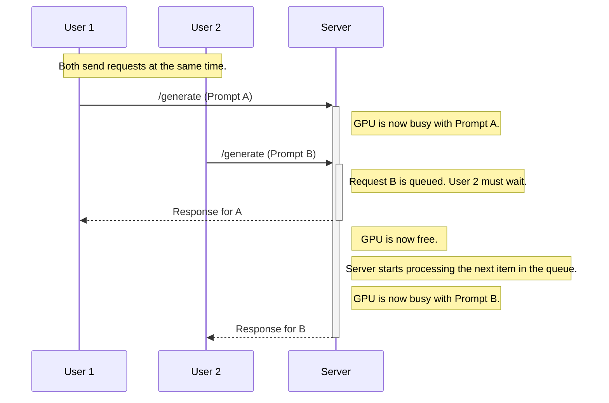
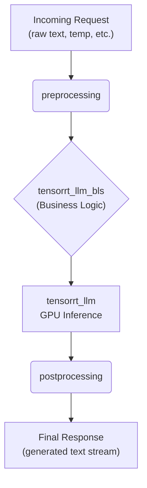
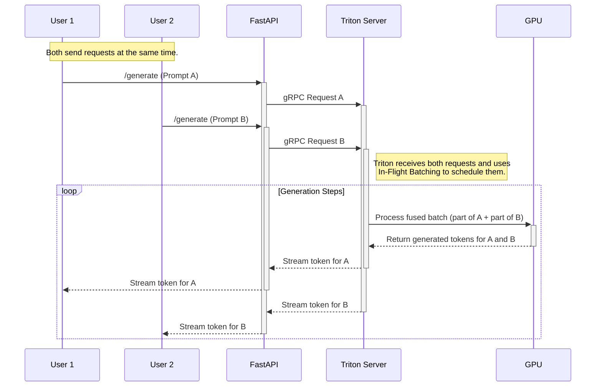
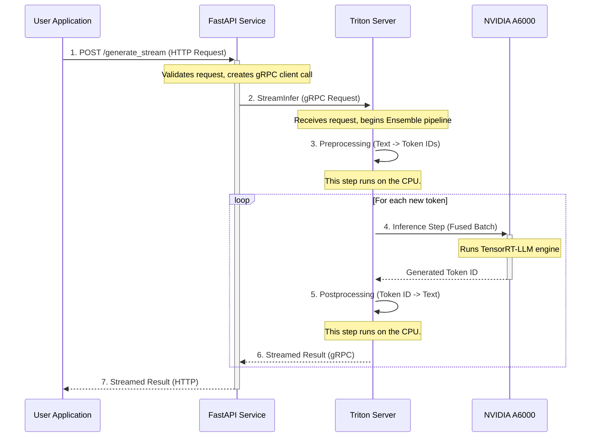
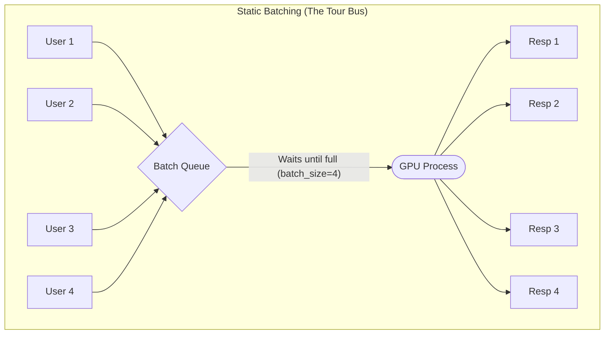
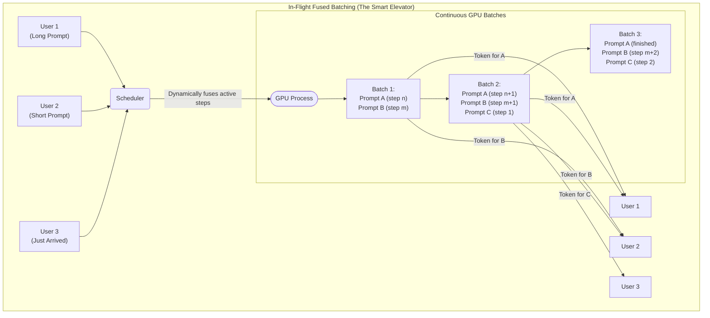

# High-Performance Llama 3.1 8B API with 96k Context on Triton**

This repository provides a complete, step-by-step guide to deploying Meta's Llama 3.1 8B Instruct model with a 96,000 token context length. The deployment uses NVIDIA TensorRT-LLM for high-performance inference, served via the Triton Inference Server, and is fronted by a production-grade FastAPI application for easy integration.

The final result is a robust, streaming-capable API service that can handle multiple concurrent users efficiently on a single NVIDIA A6000 GPU.

## Table of Contents

-   [**Step 1: System Prerequisites**](#step-1-system-prerequisites)
    -   [1.1 Install Docker](#11-install-docker)
    -   [1.2 Install NVIDIA Container Toolkit](#12-install-nvidia-container-toolkit)
-   [**Step 2: NVIDIA NGC Authentication**](#step-2-nvidia-ngc-authentication)
    -   [2.1 Get Your NGC API Key](#21-get-your-ngc-api-key)
    -   [2.2 Log in via Docker](#22-log-in-via-docker)
-   [**Step 3: Download Triton Server Image**](#step-3-download-triton-server-image)
-   [**Step 4: Download the Llama 3.1 Model**](#step-4-download-the-llama-31-model)
-   [**Step 5: Build the TensorRT-LLM Engine**](#step-5-build-the-tensorrt-llm-engine)
    -   [5.1 Convert Hugging Face Model to TensorRT-LLM Checkpoint](#51-convert-hugging-face-model-to-tensorrt-llm-checkpoint)
    -   [5.2 Build the Optimized Engine from the Checkpoint](#52-build-the-optimized-engine-from-the-checkpoint)
-   [**Step 6: Prepare and Launch Triton Server**](#step-6-prepare-and-launch-triton-server)
    -   [6.1 Prepare the Triton Model Repository](#61-prepare-the-triton-model-repository)
    -   [6.2 Correct Host File Permissions](#62-correct-host-file-permissions)
    -   [6.3 Launch the Triton Server Container](#63-launch-the-triton-server-container)
-   [**Step 7: Run the Production API Service**](#step-7-run-the-production-api-service)
    -   [7.1 Prerequisites](#71-prerequisites)
    -   [7.2 Create Conda Environment](#72-create-conda-environment)
    -   [7.3 Install Dependencies](#73-install-dependencies)
    -   [7.4 Configure the Service](#74-configure-the-service)
    -   [7.5 Run the API Server](#75-run-the-api-server)
    -   [7.6 Test the API Endpoints](#76-test-the-api-endpoints)
-   [**Appendix: Parameter Explanations**](#appendix-parameter-explanations)
    -   [`convert_checkpoint.py` Arguments](#convert_checkpointpy-arguments)
    -   [`trtllm-build` Arguments](#trtllm-build-arguments)
    -   [Triton `config.pbtxt` Arguments](#triton-configpbtxt-arguments)

---

## Step 1: System Prerequisites

This section covers the base software required on your host machine to interact with NVIDIA GPUs inside Docker containers.

### 1.1 Install Docker

```bash
sudo apt-get update
sudo apt-get install -y docker.io

# Add your user to the docker group to run docker without sudo
# NOTE: You must log out and log back in for this change to take effect.
sudo usermod -aG docker ${USER}

echo "----------------------------------------------------"
echo "-> You will need to log out and log back in for docker group changes to apply."
echo "-> Or, you can start a new shell with: newgrp docker"
echo "----------------------------------------------------"
```

### 1.2 Install NVIDIA Container Toolkit

This toolkit allows Docker containers to access your NVIDIA GPU.

```bash
# Add the NVIDIA repository and key
curl -fsSL https://nvidia.github.io/libnvidia-container/gpgkey | sudo gpg --dearmor -o /usr/share/keyrings/nvidia-container-toolkit-keyring.gpg \
  && curl -s -L https://nvidia.github.io/libnvidia-container/stable/deb/nvidia-container-toolkit.list | \
    sed 's#deb https://#deb [signed-by=/usr/share/keyrings/nvidia-container-toolkit-keyring.gpg] https://#g' | \
    sudo tee /etc/apt/sources.list.d/nvidia-container-toolkit.list

# Install the toolkit
sudo apt-get update
sudo apt-get install -y nvidia-container-toolkit

# Configure Docker to use the NVIDIA runtime and restart the Docker daemon
sudo nvidia-ctk runtime configure --runtime=docker
sudo systemctl restart docker
```

---

## Step 2: NVIDIA NGC Authentication

To download the pre-built Triton container, you need to authenticate with the NVIDIA NGC catalog.

### 2.1 Get Your NGC API Key

1.  Go to the NVIDIA NGC website: **[https://ngc.nvidia.com](https://ngc.nvidia.com)**
2.  Sign in or create a free account.
3.  In the top-right corner, click your user name and select **"Setup"**.
4.  On the Setup page, click **"Get API Key"** and then **"Generate API Key"**.
5.  **IMPORTANT:** A long alphanumeric string will be displayed. This is your API key. Copy this key immediately and save it somewhere safe. You will not be able to see it again.

### 2.2 Log in via Docker

Use the API key to log in to the NVIDIA Container Registry (`nvcr.io`).

```bash
docker login nvcr.io
```

The command will prompt you for a `Username` and a `Password`:

-   **Username:** Enter the literal string `**$oauthtoken**`
-   **Password:** Paste the **NGC API Key** you just generated. (Note: The password will be invisible as you type/paste it).

You should see a `Login Succeeded` message.

---

## Step 3: Download Triton Server Image

Pull the specific Triton Server image that includes TensorRT-LLM support.

```bash
docker pull nvcr.io/nvidia/tritonserver:25.05-trtllm-python-py3
```

---

## Step 4: Download the Llama 3.1 Model

We will download the model weights from Hugging Face and create directories to store model data and the final Triton repository.

```bash
# Create directories on the host machine
mkdir ~/trtllm-triton-repo
mkdir ~/trtllm-data

# Install the Hugging Face command-line tool
pip install huggingface_hub

# Log in with your Hugging Face token (it will prompt you to paste it)
huggingface-cli login

# Download the model files into the data directory
huggingface-cli download meta-llama/Meta-Llama-3.1-8B-Instruct --local-dir ~/trtllm-data/llama-3.1-8b-hf
```

---

## Step 5: Build the TensorRT-LLM Engine

This is the most critical step, where we convert the Hugging Face model into a highly optimized engine for inference. These commands are run inside the Triton container.

### 5.1 Convert Hugging Face Model to TensorRT-LLM Checkpoint

First, launch an interactive container session with the required directories mounted.

```bash
# Start an interactive container
docker run --gpus all -it --rm \
  -v ~/trtllm-data:/data \
  -v ~/trtllm-triton-repo:/triton_repo \
  nvcr.io/nvidia/tritonserver:25.05-trtllm-python-py3
```

> You are now inside the container.
> - The HF model is available at `/data/llama-3.1-8b-hf`
> - The output repository will be at `/triton_repo`

Now, run the following commands *inside the container*:

```bash
# Inside container: Create a workspace and clone TensorRT-LLM
mkdir -p /workspace && cd /workspace
git clone https://github.com/NVIDIA/TensorRT-LLM.git
cd TensorRT-LLM
git checkout v0.19.0

# Inside container: Install dependencies
pip install -r requirements.txt

# Inside container: Create a directory for the converted checkpoint
mkdir -p /data/llama-3.1-8b-tllm-ckpt

# Inside container: Run the conversion script (INT8 weight-only quantization)
python examples/llama/convert_checkpoint.py \
    --model_dir /data/llama-3.1-8b-hf \
    --output_dir /data/llama-3.1-8b-tllm-ckpt \
    --dtype float16 \
    --use_weight_only \
    --weight_only_precision int8
```

### 5.2 Build the Optimized Engine from the Checkpoint

This command uses the checkpoint to build the final, runnable engine, configured for our specific needs (96k input length, paged attention).

```bash
# Inside container: Build the engine
trtllm-build \
    --checkpoint_dir /data/llama-3.1-8b-tllm-ckpt \
    --output_dir /data/llama-3.1-8b-96k-engine/ \
    --gpt_attention_plugin auto \
    --max_batch_size 4 \
    --max_input_len 96000 \
    --max_seq_len 131072 \
    --use_paged_context_fmha enable \
    --multiple_profiles enable
```

Once the build is complete, you can leave the interactive container:
```bash
# Inside container:
exit
```

---

## Step 6: Prepare and Launch Triton Server

Now we configure the Triton model repository and launch the server as a background service.

### 6.1 Prepare the Triton Model Repository

These steps are also performed *inside a container*.

```bash
# Start a new interactive container
docker run --gpus all -it --rm \
  -v ~/trtllm-data:/data \
  -v ~/trtllm-triton-repo:/triton_repo \
  nvcr.io/nvidia/tritonserver:25.05-trtllm-python-py3
```

Inside the new container, run these commands:

```bash
# Inside container: Clone the backend repository
cd /workspace
git clone -b r25.05 https://github.com/triton-inference-server/tensorrtllm_backend.git

# Inside container: Copy the model template files
cp -r /workspace/tensorrtllm_backend/all_models/inflight_batcher_llm/* /triton_repo/

# Inside container: Use the fill_template.py script to configure the models
# Note the engine_dir path now correctly points to our built engine.

# ensemble/config.pbtxt
python /workspace/tensorrtllm_backend/tools/fill_template.py -i /triton_repo/ensemble/config.pbtxt \
    triton_max_batch_size:4,logits_datatype:TYPE_FP32

# preprocessing/config.pbtxt
python /workspace/tensorrtllm_backend/tools/fill_template.py -i /triton_repo/preprocessing/config.pbtxt \
    triton_max_batch_size:4,tokenizer_dir:/data/llama-3.1-8b-hf,preprocessing_instance_count:1

# postprocessing/config.pbtxt
python /workspace/tensorrtllm_backend/tools/fill_template.py -i /triton_repo/postprocessing/config.pbtxt \
    triton_max_batch_size:4,tokenizer_dir:/data/llama-3.1-8b-hf,postprocessing_instance_count:1

# tensorrt_llm/config.pbtxt (Corrected)
python /workspace/tensorrtllm_backend/tools/fill_template.py -i /triton_repo/tensorrt_llm/config.pbtxt \
    triton_backend:tensorrtllm,triton_max_batch_size:4,decoupled_mode:True,max_beam_width:1,engine_dir:/data/llama-3.1-8b-96k-engine,batching_strategy:inflight_fused_batching,max_tokens_in_paged_kv_cache:131072,kv_cache_free_gpu_mem_fraction:0.85,exclude_input_in_output:True,logits_datatype:TYPE_FP32,encoder_input_features_data_type:TYPE_FP16

# tensorrt_llm_bls/config.pbtxt
python /workspace/tensorrtllm_backend/tools/fill_template.py -i /triton_repo/tensorrt_llm_bls/config.pbtxt \
    triton_max_batch_size:4,decoupled_mode:True,bls_instance_count:1,accumulate_tokens:False,logits_datatype:TYPE_FP32
```
Once done, exit the container: `exit`.

### 6.2 Correct Host File Permissions

The files created inside the container are owned by the root user. Change ownership to your current user.

```bash
# On your host machine
sudo chown -R $USER:$USER ~/trtllm-triton-repo
```

### 6.3 Launch the Triton Server Container

Run the Triton server in detached mode, exposing the necessary ports and mounting the data and model repository directories.

```bash
docker run --gpus all -d --name triton_server \
  --shm-size=1g \
  -p 8000:8000 \
  -p 8001:8001 \
  -p 8002:8002 \
  -v ~/trtllm-data:/data \
  -v ~/trtllm-triton-repo:/models \
  nvcr.io/nvidia/tritonserver:25.05-trtllm-python-py3 \
  tritonserver --model-repository=/models --log-verbose=1
```

You can monitor its startup logs to ensure the models load correctly:
```bash
docker logs -f triton_server
```
Look for a `READY` status for the `ensemble` model. To remove the server later, run `docker rm -f triton_server`.

---

## Step 7: Run the Production API Service

With the Triton server running, we can now launch our user-facing FastAPI service which provides a clean, easy-to-use interface.

### 7.1 Prerequisites

This service uses Python. We recommend using `conda` to manage environments.

-   [Miniconda](https://docs.conda.io/projects/miniconda/en/latest/) or [Anaconda](https://www.anaconda.com/download) must be installed.

### 7.2 Create Conda Environment

Create a dedicated environment for the service to avoid dependency conflicts.

```bash
conda create -n llm_service python=3.10 -y
conda activate llm_service
```

### 7.3 Install Dependencies

Install all required Python packages from the `requirements.txt` file.

```bash
pip install -r requirements.txt
```

### 7.4 Configure the Service

The API service is configured via the `.env` file in the project root. Create it -Open it and ensure the settings match your setup. The defaults should work if you followed this guide exactly.

-   `TRITON_URL`: Should be `localhost:8001`.
-   `MODEL_NAME`: Should be `ensemble`.
-   `MAX_TOKENS`: The default maximum output length. Can be overridden per-request.

the ```.env``` should look like this

```bash
# --- LLM Service Environment Variables ---
# Use this file to override default settings from config.py

# -- Triton Settings --
TRITON_URL="localhost:8001"
MODEL_NAME="ensemble"
DEFAULT_MODEL_ID="meta-llama/Meta-Llama-3.1-8B-Instruct"

# -- Generation Parameters --
# The default maximum number of tokens for a request.
MAX_TOKENS=32768

# -- Logging Settings --
LOG_LEVEL="INFO" # Options: DEBUG, INFO, WARNING, ERROR

# -- Server Settings --
# Host and port for the FastAPI service
HOST="0.0.0.0"
PORT=8000

# Number of worker processes for Gunicorn.
# Adjust based on your server's CPU cores. (2 * num_cores) + 1 is a good start.
WORKERS=4
```

### 7.5 Run the API Server

Use the provided shell script to launch the application with Gunicorn, a production-ready web server.

```bash
chmod +x run.sh
./run.sh
```

You should see output indicating the server has started on `http://0.0.0.0:8000`.

### 7.6 Test the API Endpoints

You can now send requests from any of your applications or test with `curl`.

#### Non-Streaming Request

This waits for the full response before returning.

```bash
curl -X POST http://localhost:8000/generate \
-H "Content-Type: application/json" \
-d '{
  "prompt": "An NVIDIA A6000 GPU is a powerful tool for",
  "temperature": 0.1
}'
```

#### Streaming Request

This returns tokens as soon as they are generated, ideal for interactive UIs.

```bash
curl -N -X POST http://localhost:8000/generate_stream \
-H "Content-Type: application/json" \
-d '{
  "prompt": "The future of artificial intelligence will likely be",
  "temperature": 0.5,
  "max_tokens": 100
}'
```

---

## Appendix: Parameter Explanations

### `convert_checkpoint.py` Arguments

| Category | Argument | Your Value | Justification |
|:---|:---|:---|:---|
| **I/O** | `--model_dir` | `/data/llama-3.1-8b-hf`| **Required.** Points to the source Hugging Face model. |
| | `--output_dir` | `/data/llama-3.1-8b-tllm-ckpt`| **Required.** Destination for the converted checkpoint. |
| **Quantization** | `--dtype` | `float16` | **Best Choice.** Sets the precision for activations and the KV Cache. `float16` KV Cache is **required** for compatibility with `use_paged_context_fmha` (long context). |
| | `--use_weight_only`| `(Set)` | **Essential.** The master switch that enables INT8 weight-only quantization for the model's linear layers. |
| | `--weight_only_precision`| `int8` | **Best Choice.** Instructs the converter to quantize weights to INT8, providing the best performance on the A6000's INT8 Tensor Cores. |
| **KV Cache** | `--int8_kv_cache` | `(Not Set)` | **Correctly Omitted.** Using `int8_kv_cache` is **incompatible** with `use_paged_context_fmha`. Achieving the 96k context goal requires paged attention, so this must be omitted. |

### `trtllm-build` Arguments

| Category | Argument | Your Value | Justification |
|:---|:---|:---|:---|
| **I/O** | `--checkpoint_dir` | `/data/llama-3.1-8b-tllm-ckpt`| **Required.** Path to the converted checkpoint. |
| | `--output_dir` | `/data/llama-3.1-8b-96k-engine/`| **Required.** Where to save the final, compiled engine files. |
| **Engine Capacity**| `--max_batch_size` | `4` | Defines the maximum number of requests to process in a single batch. Must be consistent across all configs. |
| | `--max_input_len` | `96000` | **Your Goal.** Sets the maximum number of tokens allowed in the input prompt. |
| | `--max_seq_len` | `131072` | **Your Goal.** Sets the absolute maximum sequence length (input + output). This must be >= `max_input_len`. |
| **Plugins** | `--gpt_attention_plugin`| `auto` | Automatically selects the most optimized attention kernel available. |
| | `--use_paged_context_fmha`| `enable` | **Critical.** Enables Paged and Fused Multi-Head Attention, the key technology for handling very long context lengths efficiently. |
| | `--multiple_profiles` | `enable` | Creates multiple optimization profiles, which can improve performance for inputs of varying lengths. |

### Triton `config.pbtxt` Arguments

This table explains the parameters for the final `tensorrt_llm/config.pbtxt` configuration.

| Parameter | Your Value | Grounded Logic & Reasoning |
|:---|:---|:---|
| **`batching_strategy`** | `inflight_fused_batching` | **Logic:** This enables the core feature for high throughput: in-flight batching. It dynamically manages requests, maximizing GPU utilization, which is essential for serving multiple users. |
| **`decoupled_mode`** | `True` | **Logic:** This enables streaming output (tokens are sent back as they are generated). This is a requirement for any interactive application. |
| **`max_tokens_in_paged_kv_cache`** | `131072` | **Logic:** This is a **critical safeguard** for your long context. It defines the absolute maximum number of tokens that the paged KV cache manager can hold across all active requests. It **must** be at least as large as your `max_seq_len` (131072) to handle even a single max-length request. |
| **`kv_cache_free_gpu_mem_fraction`** | `0.85` | **Logic:** This is your primary memory control knob. It tells the backend: "After loading the model weights, take 85% of the *remaining free VRAM* and dedicate it to the KV cache." For a high-VRAM card like the A6000, this is the best approach to dynamically allocate a large pool for the KV cache. |
| **`engine_dir`** | `/data/llama-3.1-8b-96k-engine` | **Logic:** **This is the correct path.** It is the absolute path inside the container to the directory containing your compiled `rank0.engine`. It must match the `--output_dir` from the `trtllm-build` step. |
| **`exclude_input_in_output`**| `True` | **Logic:** A standard setting for chat/instruction models. It prevents the server from echoing the user's (potentially very long) prompt, saving bandwidth. |
| **`encoder_input_features_data_type`**| `TYPE_FP16` | **Logic:** This specifies the data type for certain inputs. Since our model's `--dtype` was `float16`, this ensures compatibility. |
| **Others** | `triton_backend:tensorrtllm`, `triton_max_batch_size:4`, etc. | **Logic:** These ensure consistency with the other configuration files and the engine build itself. They are mandatory and must match. |


### Configure `ensemble/config.pbtxt`

This is the top-level configuration that defines the entire inference pipeline, chaining the preprocessing, business logic, core model, and postprocessing steps together.

| Parameter | Your Value | Grounded Logic & Reasoning |
| :--- | :--- | :--- |
| **`triton_max_batch_size`** | `4` | **Why:** This value **must match** the `--max_batch_size 4` you used when you ran `trtllm-build`. This top-level ensemble config tells Triton the maximum number of requests it can group together before sending them down the pipeline. Consistency is critical for the server to function correctly. |
| **`logits_datatype`** | `TYPE_FP32` | **Why:** This controls the precision of the model's final output scores before sampling. `TYPE_FP32` is the safest and most standard choice for preserving numerical accuracy and avoiding potential issues during the final token selection (e.g., in temperature or top-p sampling). |

### Configure `preprocessing/config.pbtxt`

This model is responsible for taking the raw input string from the user and converting it into token IDs that the TensorRT-LLM engine can understand.

| Parameter | Your Value | Grounded Logic & Reasoning |
| :--- | :--- | :--- |
| **`triton_max_batch_size`** | `4` | **Why:** This must be consistent across all configs. It matches the `max_batch_size` used for the ensemble config and the `trtllm-build` command. |
| **`tokenizer_dir`** | `/data/llama-3.1-8b-hf` | **Why:** This is the absolute path *inside the container* to the directory where the Hugging Face tokenizer files (`tokenizer.model`, `tokenizer.json`, etc.) are located. The Python backend for this step needs this exact path to load the vocabulary and correctly convert input text into token IDs. |
| **`preprocessing_instance_count`** | `1` | **Why:** This sets how many parallel CPU processes to use for tokenization. `1` is a safe, standard default. You could increase this later if performance monitoring reveals that text tokenization is a CPU bottleneck for your service under heavy load. |

### Configure `postprocessing/config.pbtxt`

This model does the reverse of preprocessing: it takes the output token IDs generated by the engine and converts them back into human-readable text.

| Parameter | Your Value | Grounded Logic & Reasoning |
| :--- | :--- | :--- |
| **`triton_max_batch_size`** | `4` | **Why:** This must be consistent across all configs and match the batch size you built the engine with (`4`). |
| **`tokenizer_dir`** | `/data/llama-3.1-8b-hf` | **Why:** This is the absolute path to the tokenizer files. The Python backend for this step needs this path to correctly map the output token IDs back into words. |
| **`postprocessing_instance_count`** | `1` | **Why:** This sets how many parallel CPU processes to use for detokenization. `1` is a safe, standard default. It can be increased later if postprocessing becomes a bottleneck. |

### Configure `tensorrt_llm_bls/config.pbtxt`

This model implements the Business Logic Scripting (BLS) for the pipeline. It acts as the "manager" that orchestrates the flow of data to and from the core `tensorrt_llm` model, especially for complex patterns like in-flight batching and streaming.

| Parameter | Your Value | Grounded Logic & Detailed Reasoning |
|:---|:---|:---|
| **`triton_max_batch_size`** | `4` | **Logic:** Ensures consistency across the entire pipeline. It must match the value used in `trtllm-build` and all other `config.pbtxt` files. |
| **`decoupled_mode`** | `True` | **Logic:** **Crucial for streaming.** This must match the `decoupled_mode:True` setting from the `tensorrt_llm/config.pbtxt`. It tells this "manager" component to operate in an asynchronous, non-blocking way, which is required to handle the streaming of tokens from the backend engine. |
| **`bls_instance_count`** | `1` | **Logic:** This defines how many parallel CPU processes run this business logic script. `1` is a safe and standard default. This can be tuned later if this specific step is identified as a performance bottleneck. |
| **`accumulate_tokens`** | `False` | **Logic:** **Also crucial for streaming.** When set to `False`, this component does *not* wait for the entire sequence to be generated. It passes tokens through to the `postprocessing` step as soon as they arrive from the engine. If this were `True`, it would buffer the entire response and destroy the streaming effect. |
| **`logits_datatype`** | `TYPE_FP32` | **Logic:** Ensures numerical stability and consistency. It matches the data type for logits specified in the other configuration files, ensuring data flows correctly through the pipeline. |


---


# Documentation: From Prototype to Production

For anyone coming from a research or prototyping background, the Hugging Face `transformers` library is the gold standard. It is an incredible tool for its ease of use, extensive model hub, and vibrant community. A simple call can get a powerful model running in minutes:

```python
from transformers import pipeline

# This is familiar, easy, and powerful for single-user scenarios.
generator = pipeline("text-generation", model="meta-llama/Meta-Llama-3.1-8B-Instruct")
result = generator("The future of AI is...")
```

So, why not just wrap this `pipeline` in a FastAPI server and call it a day?

Because a **prototype** and a **production service** solve fundamentally different problems. A prototype needs to *work*. A production service needs to *perform*—reliably, efficiently, and for many users at once.

---

## The Production Challenge: The Limits of a Simple Pipeline

Imagine your service gets 10 user requests at the same time. A basic Hugging Face implementation, by default, will handle them **sequentially**. This creates two major problems: high latency and wasted GPU resources.

We can visualize this blocking behavior:


This leads to:
1.  **High Latency:** The last user in the queue waits for everyone else to finish. Their experience is terrible.
2.  **Wasted GPU Potential:** The GPU, a massively parallel processor, is often underutilized, only working on one sequence at a time.

To solve this, we introduce a specialized stack: **TensorRT-LLM** and the **Triton Inference Server**.

---

## The Solution, Component by Component

Instead of one tool that does everything reasonably well, we use two specialized tools that do their individual jobs with maximum performance.

### 1. What is TensorRT-LLM? (The Engine Optimizer)

**Analogy:** Think of the default PyTorch model from Hugging Face as a high-quality, road-legal engine in a luxury car. It's powerful and versatile. **TensorRT-LLM is a Formula 1 engineering team that rebuilds that engine specifically for a race track (your NVIDIA A6000 GPU).**

The F1 team does several things:
*   **Strips Out Unnecessary Parts:** Removes parts of the model code only used for training, not inference.
*   **Fuses Operations (Kernel Fusion):** Instead of telling the GPU "do task A, then task B, then task C," it fuses them into a single, highly optimized instruction: "do task ABC." This dramatically reduces overhead.
*   **Uses Lighter Materials (Quantization):** It converts model weights from heavy `FP16` numbers into lighter `INT8` numbers. This means the model takes up less VRAM and calculations are much faster on the GPU's specialized INT8 Tensor Cores. (For more, see [Quantization Explained](./03_quantization_explained.md)).
*   **Optimizes for the Track (Hardware-Specific Compilation):** The final engine is compiled *specifically* for the architecture of your A6000 GPU, taking advantage of its unique features. It's not a general-purpose engine anymore; it's a bespoke racing engine.

The output of `trtllm-build` is a `.engine` file. This is no longer a flexible PyTorch model; it's a rigid, black-box, speed-optimized inference engine.

### 2. What is Triton Inference Server? (The Airport Traffic Controller)

**Analogy:** If TensorRT-LLM builds the lightning-fast race car, **Triton is the entire airport operations team managing hundreds of planes (user requests) landing on and taking off from the runways (your GPU).**

A single car on a track is fast, but an airport needs to handle massive, concurrent traffic safely and efficiently. Triton's job is to:

*   **Load Models (`.engine` files):** It loads our TensorRT-LLM engine into GPU memory, ready to receive requests.
*   **Manage Concurrent Requests:** It's built from the ground up to accept thousands of simultaneous connections without breaking a sweat.
*   **Dynamic Batching:** This is its most critical feature. Instead of waiting for a "batch" of 4 requests to arrive before starting (static batching), Triton can dynamically group requests that are in-flight, maximizing GPU utilization. (For more, see [Concurrency & Batching](./05_concurrency_and_batching.md)).
*   **Orchestrate Pipelines (Ensembles):** A raw request is just text. The engine needs token IDs. Triton manages the entire pipeline, as defined in our model repository.

Here is what Triton's internal workflow (our "ensemble" model) looks like:


Triton manages sending the data between these steps automatically. This lets us use simple Python for pre/post-processing while using the hyper-optimized engine for the heavy lifting on the GPU.

---

## The Production Solution in Action

With our full stack, the workflow for handling 2 concurrent users looks completely different and far more efficient.



## Final Comparison

| Feature                 | Hugging Face `pipeline` (Default) | Triton + TensorRT-LLM Stack                                  |
| :---------------------- | :-------------------------------- | :----------------------------------------------------------- |
| **Primary Goal**        | Ease of use, rapid prototyping.   | High performance, high concurrency, production stability.    |
| **Key Technology**      | PyTorch / TensorFlow              | **TensorRT-LLM:** Kernel Fusion, Quantization<br>**Triton:** In-Flight Batching, C++ Server |
| **Performance**         | Baseline                          | **State-of-the-Art.** Up to 8x faster than baseline on NVIDIA GPUs. |
| **Concurrency**         | **Sequential.** Processes one request at a time. | **Truly Concurrent.** Manages thousands of simultaneous requests. |
| **Memory Usage**        | High (FP16/FP32 weights)          | **Optimized.** INT8 weights + Paged KV Cache reduce VRAM pressure significantly. |
| **Deployment Model**    | Simple Python script              | Decoupled client-server architecture.                        |

**Conclusion:** While Hugging Face is the perfect tool to start your journey, it's not designed for the demands of a high-traffic, low-latency production environment. By graduating to a specialized stack like **TensorRT-LLM** for optimization and **Triton** for serving, you are moving from building a working car to engineering a complete, high-performance transportation system.


# Documentation: System Architecture

Understanding how a user's request travels through the system is key to debugging issues and appreciating the role of each component. Our service is not a single program, but a pipeline of specialized applications working together. This document traces that path from start to finish.

## The Journey of a Request

At a high level, the system is a client-server architecture. Our FastAPI application acts as a client to the true powerhouse: the Triton Inference Server.

Here is the sequence of events for a single API call to our service:



## Component Roles & Responsibilities

Let's break down the job of each piece of the puzzle.

### 1. The FastAPI Service (The Front Door)

-   **File:** `llm_service/main.py`
-   **What it is:** A user-friendly web server acting as the public-facing interface for our entire system. It runs using Gunicorn and Uvicorn workers for production-grade HTTP handling.
-   **Its Responsibilities:**
    -   **Expose Clean Endpoints:** Provides simple, intuitive HTTP endpoints like `/generate` and `/generate_stream`.
    -   **Validate User Input:** Uses Pydantic models (`llm_service/models.py`) to ensure incoming requests have the correct data types (e.g., `prompt` is a string, `temperature` is a float). This prevents bad data from ever reaching the core model.
    -   **Act as a Triton Client:** This is its most important role. It translates the validated HTTP request into a highly efficient gRPC call that the Triton server understands. It uses the logic in `llm_service/triton_client.py` to do this.
    -   **Handle Streaming:** For the `/generate_stream` endpoint, it receives the gRPC stream from Triton and relays it to the user as a streaming HTTP response.

### 2. Triton Inference Server (The Airport Traffic Controller)

-   **What it is:** A high-performance, general-purpose inference server developed by NVIDIA, written in C++.
-   **Its Responsibilities:**
    -   **Load & Manage Models:** When Triton starts, it scans the `/models` directory and loads all the model configurations (`config.pbtxt`) and the actual engine files into GPU memory.
    -   **Listen for Requests:** It opens ports (e.g., 8001 for gRPC) and listens for incoming inference requests from clients like our FastAPI service.
    -   **Schedule Work for the GPU:** It holds the queue of incoming requests and uses its chosen scheduling strategy (in our case, `inflight_fused_batching`) to pack work together efficiently, maximizing GPU utilization.
    -   **Execute Model Pipelines:** When a request arrives for the `ensemble` model, Triton takes on the role of a conductor, executing the defined pipeline step-by-step.

### 3. The Triton "Ensemble" Model (The Pipeline Conductor)

-   **File:** `~/trtllm-triton-repo/ensemble/config.pbtxt`
-   **What it is:** A virtual model inside Triton. It doesn't perform any inference itself but instead defines a **Directed Acyclic Graph (DAG)** that dictates the flow of data between other models.
-   **Its Responsibilities:**
    1.  Acts as the single entry point for a request.
    2.  Receives the initial data (`prompt`, `max_tokens`, etc.) from the client.
    3.  Directs the `prompt` string to the `preprocessing` model.
    4.  Takes the output (token IDs) from `preprocessing` and sends them to the `tensorrt_llm_bls` model (the logic manager).
    5.  The `tensorrt_llm_bls` interacts with the core `tensorrt_llm` engine to generate new token IDs.
    6.  Directs the generated token IDs to the `postprocessing` model to be converted back into text.
    7.  Streams the final text from `postprocessing` back to the client that called the ensemble.

### 4. The Pipeline Sub-Models (The Specialists)

These are the individual workers that the Ensemble model conducts.

-   **`preprocessing` (CPU-bound):**
    -   A simple Python model.
    -   **Job:** Takes a raw text string and uses the Hugging Face tokenizer to convert it into a sequence of integer token IDs.

-   **`tensorrt_llm_bls` (CPU-bound):**
    -   The Business Logic Scripting (BLS) model.
    -   **Job:** A crucial "manager" script that contains the stateful logic needed to interface with the in-flight batcher. It keeps track of request states, stop conditions, and streaming flags. It's the glue between the simple pre/post processing steps and the complex core engine.

-   **`tensorrt_llm` (GPU-bound):**
    -   **This is the core engine.** It's the `rank0.engine` file we built with `trtllm-build`.
    -   **Job:** Takes a batch of token IDs and executes the hyper-optimized forward pass on the GPU's Tensor Cores to predict the next token ID. It is incredibly fast but only understands numbers, not text.

-   **`postprocessing` (CPU-bound):**
    -   Another simple Python model.
    -   **Job:** Takes the integer token IDs generated by the engine and uses the Hugging Face tokenizer to convert them back into human-readable text.

# Documentation: A Deep Dive into Quantization

Quantization is one of the most critical techniques for deploying Large Language Models in production. It is the process of reducing the numerical precision of a model's numbers (its weights and, in some cases, its activations).

The primary goals of quantization are to:
1.  **Reduce Memory Footprint:** Decrease the amount of GPU VRAM the model requires.
2.  **Increase Inference Speed:** Accelerate computation by using faster, lower-precision hardware capabilities.

Think of it like saving a professional photograph. You could save it as a massive, uncompressed `RAW` file with perfect fidelity, or as a high-quality `JPEG` which is a fraction of the size and visually almost identical. Quantization is a form of intelligent, lossy compression for AI models.

### The Building Blocks: Data Types in AI

The precision of a number in a computer is determined by how many bits are used to store it. In deep learning, these are the most common data types:

| Data Type | Bits | Technical Name | Analogy | Pros & Cons |
| :--- | :--- | :--- | :--- | :--- |
| **FP32** | 32 | Single-Precision Floating-Point | **Uncompressed `RAW` Photo** | **Pro:** Highest precision; the standard for training models to ensure accuracy and stable convergence. <br> **Con:** Very large memory footprint and computationally intensive. |
| **FP16** | 16 | Half-Precision Floating-Point | **High-Quality `PNG` File** | **Pro:** **Half the size of FP32** and significantly faster on modern GPUs with Tensor Cores. The standard for high-performance inference. <br> **Con:** Minor, often negligible, loss of precision compared to FP32. |
| **INT8** | 8 | 8-bit Integer | **High-Quality `JPEG` File** | **Pro:** **75% smaller than FP32** and **extremely fast** when using a GPU's specialized INT8 Tensor Cores. <br> **Con:** Can noticeably degrade model accuracy if not applied carefully. |

### Our Strategy: W8A16 Weight-Only Quantization

Simply converting the entire model to INT8 would be fast but could harm the model's predictive quality. Instead, we use a more sophisticated and effective strategy called **Weight-Only Quantization**, specifically the **W8A16** scheme.

This means we treat two different parts of the model—the static **Weights** and the dynamic **Activations**—differently.

#### 1. The Weights (`W8`): The Model's Brain

-   **What they are:** The billions of parameters that the model "learned" during its extensive training. They represent the crystallized knowledge of the AI. For Llama 3.1 8B, this is roughly 8 billion numbers.
-   **Our Action:** We convert these weights from their original FP16 format into **INT8**.
-   **The Impact:**
    -   **Massive Memory Savings:** This is the single biggest win for reducing the model's on-disk and in-memory size.
      - *FP16 Weights:* `8 Billion parameters * 2 bytes/FP16 ≈ 16 GB`
      - *INT8 Weights:* `8 Billion parameters * 1 byte/INT8 ≈ 8 GB`
      - We instantly save **~8 GB of VRAM** just by quantizing the weights.
    -   **Extreme Speed Boost:** The NVIDIA A6000 GPU has specialized hardware units called **INT8 Tensor Cores**. When the GPU performs matrix multiplications (the core operation of an LLM), loading these INT8 weights into those cores is dramatically faster than using FP16.

#### 2. The Activations (`A16`): The Flow of Thought

-   **What they are:** The numbers that flow *through* the model's layers during a single inference request. They represent the intermediate calculations for the specific prompt you provided.
-   **Our Action:** We keep these transient numbers at the high-precision **FP16** format.
-   **The Impact:**
    -   **Preserves Accuracy:** The intermediate calculations in an LLM are highly sensitive to numerical precision. Keeping them in FP16 ensures that the model's reasoning and generation quality remain high, avoiding the potential degradation that could come from using INT8 for these values.

The **W8A16** approach gives us the best of both worlds: the immense storage and speed benefits of INT8 for the static model weights, combined with the accuracy and stability of FP16 for the dynamic activation values.

### The Critical Exception: The KV Cache

There is a third, crucial component to consider: the **KV Cache**.

-   **What it is:** The model's short-term memory or "conversation scratchpad." After processing each token in a prompt, the model calculates and stores a "Key" (K) and "Value" (V) pair. When generating the next token, the model attends to everything in this cache to understand the context, preventing it from having to re-read the entire prompt from scratch every single time.
-   **The VRAM Problem:** The size of the KV Cache is directly proportional to the context length. For long-context models, it is the **single largest consumer of VRAM during inference**.
    -   *Rough calculation for one 96k request:* `96,000 tokens * 32 layers * 4096 hidden_dim * 2 (K and V) * 2 bytes/FP16 ≈ 50.3 GB`
-   **Our Deliberate Choice: Keeping the KV Cache in FP16**
    -   **The Reason:** The technology that enables efficient long-context inference, **Paged Attention (`use_paged_context_fmha`)**, has a critical requirement in our version of TensorRT-LLM: it is only compatible with an FP16 KV Cache.
    -   **The Engineering Trade-off:** We could have attempted to quantize the KV Cache to INT8 to save even more memory. However, this would have forced us to disable Paged Attention, making it impossible to handle a 96k context length. Therefore, we made a conscious engineering decision: **Long-context capability is more important than the additional memory savings from KV Cache quantization.**

### Summary of Our Quantization Strategy

This table summarizes the choices made for each component of the model:

| Component | Our Chosen Precision | Justification |
| :--- | :--- | :--- |
| **Model Weights** | **INT8** | **Performance & Memory.** Halves the model's storage size and leverages the A6000's ultra-fast INT8 Tensor Cores for maximum throughput. |
| **Activations** | **FP16** | **Accuracy & Stability.** Preserves the numerical precision of in-flight calculations, ensuring the model's output quality is not compromised. |
| **KV Cache** | **FP16** | **Compatibility & Functionality.** A mandatory requirement to enable `use_paged_context_fmha`, the core technology needed to serve a 96k+ context length. |

By understanding these deliberate trade-offs, you can see that our setup is not just a conversion, but a carefully engineered configuration to achieve a specific, high-performance goal: serving a very long context model to multiple users with low latency.


# Documentation: GPU Memory & Performance Demystified

An NVIDIA A6000 GPU comes with a generous 48 GB of VRAM. For most deep learning tasks, this is an enormous amount. However, for Large Language Models—especially those running with a long context—every single gigabyte is precious. Understanding where this memory goes and how to measure performance is essential for running a stable and efficient service.

## A Deep Dive into VRAM Usage

When Triton loads and runs our model, the GPU's memory is allocated to several distinct components. We can broadly categorize them into three buckets: static, highly dynamic, and transient.

### 1. Model Weights (Static Cost)

-   **What it is:** This is the physical size of the model's brain—the ~8 billion parameters of Llama 3.1 that we quantized to INT8.
-   **Characteristic:** This is a **fixed, one-time cost**. As soon as the Triton server loads the model, this memory is allocated and will not be freed until the model is unloaded. It is independent of how many users are connected or what prompts they send.
-   **VRAM Calculation:**
    -   Original Model Size (FP16): `~8,000,000,000 parameters * 2 bytes/FP16 ≈ 16 GB`
    -   Our Quantized Model Size (INT8): `~8,000,000,000 parameters * 1 byte/INT8 ≈ 8 GB`
    -   **Result:** This is our baseline memory usage. Roughly **8 GB** of our 48 GB is consumed just by having the model loaded.

### 2. The KV Cache (The Dominant, Dynamic Cost)

-   **What it is:** The model's "short-term memory" or context-keeping scratchpad. For every token of input *and* output, the model stores a corresponding Key/Value (K,V) pair. The size of this cache is the **single largest driver of VRAM consumption** during inference.
-   **Characteristic:** This cost is **highly dynamic**. It grows with every active user and with the length of their context (prompt + generated response).
-   **VRAM Calculation (The Shocking Math):**
    -   The formula is roughly: `sequence_length * num_layers * hidden_dimension * 2 (for K and V) * bytes_per_element`
    -   Let's plug in the numbers for a **single, worst-case user request** with a 96k token prompt:
        -   `96,000 tokens * 32 layers * 4096 hidden_dim * 2 * 2 bytes/FP16 ≈ 50.3 GB`
-   **How Is This Possible? The Magic of Paged Attention**
    -   The raw calculation shows that a single max-length request would require more VRAM than our GPU has! This is why the `use_paged_context_fmha` build flag is not just an optimization—it is **absolutely essential**.
    -   **Analogy:** Think of how your computer's operating system uses virtual memory (RAM + a page file on your SSD). It intelligently moves "pages" of memory around.
    -   **Paged KV Cache** works similarly. Instead of allocating one enormous, contiguous block of VRAM for the cache, it allocates memory in smaller, fixed-size "pages" or "blocks." This has two huge benefits:
        1.  **Eliminates Internal Fragmentation:** It prevents wasted memory between requests of different sizes.
        2.  **Enables Much Larger Context:** It allows the total logical size of the KV cache to exceed what could be stored in a single memory block.
-   **Controlling the Cache:** Our `tensorrt_llm/config.pbtxt` has a critical parameter: `kv_cache_free_gpu_mem_fraction: 0.85`. This tells Triton: "After you've loaded the model weights (~8 GB), take 85% of the *remaining free VRAM* and reserve it as a shared memory pool for the Paged KV Cache." This dynamic pool is then used to serve all concurrent users.

### 3. Activation Buffers & Workspace (Transient Cost)

-   **What it is:** This is the temporary memory the GPU needs for its internal calculations—the "scratchpad" for performing matrix multiplications and other operations during the forward pass.
-   **Characteristic:** This memory is **transient and fluctuating**. It is allocated and freed very rapidly for each step of the generation process. Its peak size depends on the `max_batch_size` we configured.
-   **Result:** This is a smaller but non-zero consumer of VRAM that is handled automatically by the TensorRT engine.

## Measuring Performance: The Key Performance Indicators (KPIs)

"Performance" is not a single number. For a user-facing LLM service, we care about two primary dimensions: latency (speed for one user) and throughput (capacity of the system).

### Latency: The User's Perception of Speed

| Metric | What It Measures | Why It Matters | Dominated By |
| :--- | :--- | :--- | :--- |
| **Time to First Token (TTFT)** | The time from when a user sends a request to when the very first word of the response appears. | This is the most important metric for **perceived responsiveness**. A low TTFT makes the service feel snappy and alive, even if the full response takes time. | **Prompt Processing.** The initial phase where the model "ingests" the entire user prompt into its KV Cache. |
| **Time per Output Token (TPOT)** | The time it takes to generate each subsequent token after the first one. This is often measured in milliseconds/token. | This determines the "typing speed" of the AI. A low TPOT results in a smooth, continuous stream of text. | **Decoding Steps.** A series of smaller, faster forward passes, each generating one new token. |

### Throughput: The System's Overall Capacity

| Metric | What It Measures | Why It Matters |
| :--- | :--- | :--- |
| **Requests per Second** | The number of independent user requests the service can complete in one second. | A classic server metric, but can be misleading for LLMs where one request might be 10 tokens and another might be 10,000. |
| **Output Tokens per Second** | The **total number of tokens** generated by the server across all concurrent users in one second. | **This is the best metric for LLM throughput.** It measures the actual "work output" of the GPU and normalizes for requests of different lengths. Maximizing this KPI means you are getting the most value out of your hardware. |

### The Fundamental Trade-off

In any serving system, there is a core trade-off: **increasing batching typically increases throughput but also increases latency**. Our system uses **In-Flight Fused Batching** to find a "best of both worlds" scenario, dynamically creating batches to keep the GPU busy (high throughput) without making new users wait in a queue (low latency).

### How to Monitor This in Practice

The primary command-line tool for observing your GPU in real-time is `nvidia-smi`.

```bash
# Run this command in your terminal for a live, auto-updating view
watch -n 1 nvidia-smi
```

When you run this and put your service under load, pay attention to these columns:
-   **`Memory-Usage`**: This will show you the total VRAM consumption. You'll see it jump to ~8 GB when the server starts, and then increase further as users connect and the KV Cache pool is utilized.
-   **`GPU-Util`**: This shows the percentage of time the GPU's processing cores were active. When serving requests, you want this number to be as high as possible. A consistently high `GPU-Util` means your server is efficiently feeding the GPU with work, maximizing your throughput.

# Documentation: Concurrency, Batching, and a Tale of Two Elevators

Concurrency is the ability of a service to handle multiple user requests at the same time. For a web server handling simple database queries, this is a solved problem. For a Large Language Model service, where a single request can tie up a multi-thousand-dollar GPU for seconds or even minutes, it is the single most important challenge to solve for production.

The strategy used to achieve concurrency determines the throughput, latency, and ultimate efficiency of the entire system.

### The Naive Approach: The Single-Lane Road (Sequential Processing)

The simplest possible implementation would process requests one by one, in the order they arrive.

`[User 1] -> [GPU Process] -> [Response 1]`
`                  (User 2 waits in line)  `
`[User 2] -> [GPU Process] -> [Response 2]`

-   **Problem:** This is incredibly inefficient. The GPU, a massively parallel processor, is often idle between requests. More importantly, User 2 has to wait for User 1's entire request to finish, leading to terrible latency. This model does not scale beyond a single user.

---

### The First Evolution: The Tour Bus (Static Batching)

A simple improvement is to group requests together into a "static batch." The server waits until it has collected a certain number of requests (e.g., a batch size of 4) before sending them all to the GPU at once.

**Analogy:** This is like a tour bus. The bus driver (the server) waits at the station until the bus is full before starting the tour (processing).



This approach has two critical flaws:

1.  **Head-of-Line Blocking:** If User 1 arrives, they have to wait for Users 2, 3, and 4 to show up before their request even starts. This creates high initial latency.
2.  **Wasted Computation (Padding):** LLM generation is iterative. If User 1's prompt is 100 tokens and User 2's is 1000 tokens, the server must "pad" User 1's input with 900 empty tokens to make the requests the same size for the batch. The GPU wastes cycles processing these empty pads.

---

### The Production Solution: The Modern Elevator (In-Flight Fused Batching)

This is the advanced, state-of-the-art technique used by TensorRT-LLM and enabled by our `batching_strategy: inflight_fused_batching` configuration.

**Analogy:** Forget the tour bus. Think of a modern, smart elevator in a skyscraper.
-   The static batching "tour bus" waits until it's full before moving at all.
-   The in-flight batching "elevator" is **constantly in motion**. It can be going up, pick someone up on Floor 5 (a new request), let someone off on Floor 8 (a finished request), and continue on to Floor 12 (a long-running request), all without stopping and waiting to be full.

**How it works for LLMs:**

In-Flight Batching deconstructs the generation process into individual token-by-token steps. The Triton scheduler can then dynamically "fuse" requests that are at completely different stages of their lifecycle into a single computational batch for the GPU.

At any given microsecond, the batch being sent to the GPU might contain a mix of operations:

| Request ID | Current Task |
| :--- | :--- |
| **Request A** | Processing token #50,000 of a very long initial prompt. |
| **Request B** | Generating the 5th output token (decoding step). |
| **Request C** | Generating the 120th output token (decoding step). |
| **Request D** | Processing token #10 of a brand new, short prompt that just arrived. |

The TensorRT-LLM engine executes this "fused" batch, and the Triton server intelligently routes the results back to the correct users. User B gets their 6th token, User C gets their 121st, and the processing of Prompts A and D continues.



### The Overwhelming Benefits

This modern approach is what makes high-performance LLM serving possible:

1.  **Maximum GPU Utilization:** The GPU is never idle as long as there is at least one active request in the system. There is no waiting for batches to fill up.
2.  **Extremely Low "Time to First Token":** New requests can be added to the batch and begin processing on the very next iteration, meaning users get their first token back almost immediately.
3.  **High Overall Throughput:** By keeping the GPU constantly busy with useful, non-padded work, the total number of tokens generated per second across all users is maximized.
4.  **Fairness:** The scheduler ensures that long-running requests don't starve new, short requests.

By choosing this strategy, we move from a simple, blocking system to a dynamic, fluid, and highly efficient service capable of handling a demanding, real-world user load.
